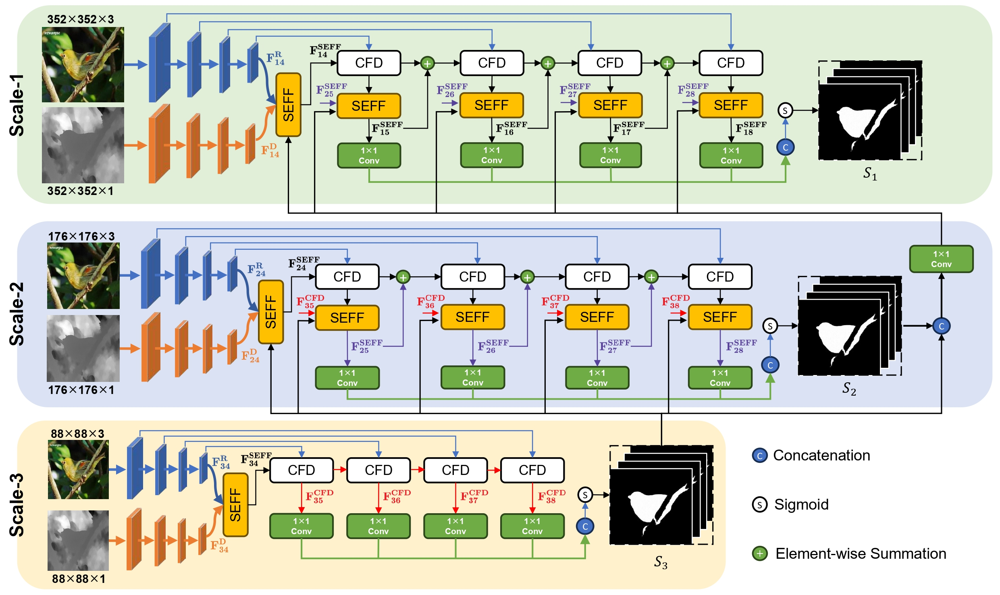
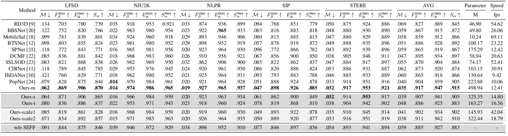

***Tips***

- We have expanded on our original work! The old version is here: [v0](https://github.com/Heprain/SEFFSal/tree/v0) or in the "v0" directory.
- We invite all to contribute to making it more accessible and useful. If you have any questions about our work, feel free to contact me via e-mail (qingy_zhao@163.com). 

# <p align=left>`Saliency Enhanced Feature Fusion based Multi-scale Network for RGB-D/T Salient Object Detection`</p>

<p align="center">
     <br />
    <em> 
    Figure 1: The framework of our multiscale RGB-D/T saliency detector.
    </em>
</p>


## 1. 🚀 Get Start

**0. Install**
> Note: This code was developed on Ubuntu 20.04 with Python 3.7, CUDA 11.7, and PyTorch 1.13.1.

Clone the repo.
```
git clone https://github.com/Heprain/SEFFSal.git
cd SEFFSal/
```

Create a virtual environment using Conda and activate the environment.
```
conda create -n seff python=3.7 -y
conda activate seff 
```

Install PyTorch
```
conda install pytorch==1.13.1 torchvision==0.14.1 torchaudio==0.13.1 -c pytorch
```

Install other dependencies.
```
pip install opencv-python
pip install matplotlib
pip install timm
```

**1. Download Datasets and Checkpoints.**

- **Datasets:** 

Download the raw data from [Google Drive](https://drive.google.com/file/d/1TZUzSi-k8SS_y-g8dt2frx4kMCO-YSwT/view?usp=drive_link). 


- **Checkpoints:** 

FasterNet Pre-trained models T/S/M can be downloaded at:

| name | resolution | acc | #params | FLOPs | model |
|:---:|:---:|:---:|:---:| :---:|:---:|
| FasterNet-T2 | 224x224 | 78.9 | 15.0M | 1.90G | [model](https://github.com/JierunChen/FasterNet/releases/download/v1.0/fasternet_t2-epoch.289-val_acc1.78.8860.pth) |
| FasterNet-S | 224x224 | 81.3 | 31.1M | 4.55G | [model](https://github.com/JierunChen/FasterNet/releases/download/v1.0/fasternet_s-epoch.299-val_acc1.81.2840.pth) |
| FasterNet-M | 224x224 | 83.0 | 53.5M | 8.72G | [model](https://github.com/JierunChen/FasterNet/releases/download/v1.0/fasternet_m-epoch.291-val_acc1.82.9620.pth) |

 <br />


<details>
<summary>Orgnize the checkpoints and dataset folder in the following structure:</summary>
<pre><code>
    
```shell
<Dataset>
    |-- <Train>
        |-- <depth>
            |-- ...
        |-- <GT>
            |-- ...
        |-- <RGB>
            |-- ...
    |-- <test_in_train>
        |-- <depth>
            |-- ...
        |-- <GT>
            |-- ...
        |-- <RGB>
            |-- ...
    |-- <Test>
        |-- <DatasetName1>
            |-- <depth>
                |-- <name1>.<DepthFormat>
                |-- <name2>.<DepthFormat>
            |-- <GT>
                |-- <name1>.<ImageFormat>
                |-- <name2>.<ImageFormat>
                ...
            |-- <RGB>
                |-- <name1>.<DepthFormat>
                |-- <name2>.<DepthFormat>
        |-- <DatasetName2>
        |-- ...
<SEFFSal-main>
    |-- <pretrained>
        |-- <fasternet_m...>
        |-- <fasternet_s...>
        |-- <fasternet_t2...>
```
</code></pre>
</details>

 <br /> 

**2. Train.**

You can modify the 'train.sh' or 'options.py' to choose the model for training. 
```
bash train.sh
```
After training, the checkpoints will be saved in the path `snapshots/xx_ep101/', where the xx depends on the training config.

**3. Test.**

```
bash test.sh
```
After testing, the saliency map will be saved in the path `map/xx_ep101/'.

**4. Eval.**

You can evaluate the result maps using the tool in [Python_GPU Version](https://github.com/zyjwuyan/SOD_Evaluation_Metrics) or [Matlab Version](http://dpfan.net/d3netbenchmark/).


## 🚩 Performance
> Note: Each of the compared methods was retrained using their default setting, except for image size (352 × 352) and number of epochs (100).
<p align="center">
     <br />
    <em> 
    Figure 2: Quantitative comparison of different RGB-D SOD methods.
    </em>
</p> 

<p align="center">
     <br />
    <em> 
    Figure 3: Some typical results of different RGB-D SOD methods on various scenes.
    </em>
</p>

Test results of the above datasets(except for ablation experiments) can be downloaded from [Google Drive](https://drive.google.com/file/d/1FyCv4DXjz888GC323ueaIsnu4qOlGD2J/view?usp=drive_link).

## Reference
You may want to cite:
```
@misc{huang2024saliency,
      title={A Saliency Enhanced Feature Fusion based multiscale RGB-D Salient Object Detection Network}, 
      author={Rui Huang and Qingyi Zhao and Yan Xing and Sihua Gao and Weifeng Xu and Yuxiang Zhang and Wei Fan},
      year={2024},
      eprint={2401.11914},
      archivePrefix={arXiv},
      primaryClass={cs.CV}
}
```


### Acknowledgment

Our implementation is mainly based on [MobileSal](https://github.com/yuhuan-wu/mobilesal) and [FasterNet](https://github.com/JierunChen/FasterNet). Thanks to their authors.


### License

The code in this repo is for non-commercial use only.
