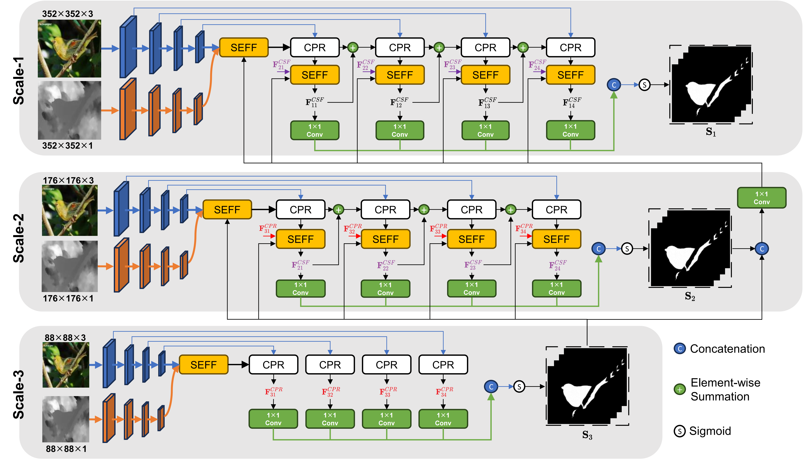

# <p align=left>`A SALIENCY ENHANCED FEATURE FUSION BASED MULTISCALE RGB-D SALIENT OBJECT DETECTION NETWORK (ICASSP 2024)`</p>

<!--  -->

This official repository contains the source code, pre-trained, trained checkpoints, and evaluation toolbox of the paper 'A Saliency Enhanced Feature Fusion based multiscale RGB-D Salient Object Detection Network'. The full paper could be found at [arXiv]().

We invite all to contribute to making it more accessible and useful. If you have any questions about our work, feel free to contact me via e-mail (qingy_zhao@163.com). 

<p align="center">
     <br />
    <em> 
    Figure 1: The framework of our multiscale RGB-D saliency detector.
    </em>
</p>


## 1. 🌟  NEWS 

- [2023/12/14] Our SEFFSal has been accepted by the 2024 IEEE International Conference on Acoustics, Speech, and Signal Processing (ICASSP 2024).
- [2024/1/22]  Releasing the codebase of SEFFSal and all the pre-trained checkpoints.


## 2. 🚀 Get Start

**0. Install**
> Note: This code was developed on Ubuntu 20.04 with Python 3.7, CUDA 11.7, and PyTorch 1.13.1.

Clone the repo.
```
git clone https://github.com/Heprain/SEFFSal.git
cd SEFFSal/
```

Create a virtual environment using Conda and activate the environment.
```
conda create -n seff python=3.7 -y
conda activate seff 
```

Install PyTorch
```
conda install pytorch==1.13.1 torchvision==0.14.1 torchaudio==0.13.1 -c pytorch
```

Install other dependencies.
```
pip install opencv-python
pip install matplotlib
pip install timm
```

**1. Download Datasets and Checkpoints.**

- **Datasets:** 

Download the raw data from [Google Drive](). 


- **Checkpoints:** 

FasterNet Pre-trained models T/S/M can be downloaded at:

| name | resolution | acc | #params | FLOPs | model |
|:---:|:---:|:---:|:---:| :---:|:---:|
| FasterNet-T2 | 224x224 | 78.9 | 15.0M | 1.90G | [model](https://github.com/JierunChen/FasterNet/releases/download/v1.0/fasternet_t2-epoch.289-val_acc1.78.8860.pth) |
| FasterNet-S | 224x224 | 81.3 | 31.1M | 4.55G | [model](https://github.com/JierunChen/FasterNet/releases/download/v1.0/fasternet_s-epoch.299-val_acc1.81.2840.pth) |
| FasterNet-M | 224x224 | 83.0 | 53.5M | 8.72G | [model](https://github.com/JierunChen/FasterNet/releases/download/v1.0/fasternet_m-epoch.291-val_acc1.82.9620.pth) |

 <br />


<details>
<summary>Orgnize the checkpoints and dataset folder in the following structure:</summary>
<pre><code>
    
```shell
<Dataset>
    |-- <Train>
        |-- <depth>
            |-- ...
        |-- <GT>
            |-- ...
        |-- <RGB>
            |-- ...
    |-- <Test>
        |-- <DatasetName1>
            |-- <depth>
                |-- <name1>.<DepthFormat>
                |-- <name2>.<DepthFormat>
            |-- <GT>
                |-- <name1>.<ImageFormat>
                |-- <name2>.<ImageFormat>
                ...
            |-- <RGB>
                |-- <name1>.<DepthFormat>
                |-- <name2>.<DepthFormat>
        |-- <DatasetName2>
        |-- ...
<pretrained>
    |-- <fasternet_m...>
    |-- <fasternet_s...>
    |-- <fasternet_t2...>
```
</code></pre>
</details>

 <br /> 

**2. Train.**

You can change the `local_config' files in the script to choose the model for training. 
```
bash train.sh
```

After training, the checkpoints will be saved in the path `checkpoints/XXX', where the XXX is depends on the training config.


**3. Eval.**

You can evaluate the result maps using the tool in [Python_GPU Version](https://github.com/zyjwuyan/SOD_Evaluation_Metrics) or [Matlab Version](http://dpfan.net/d3netbenchmark/).


## 🚩 Performance

<p align="left">
     <br />
    <em> 
    Figure 2: Quantitative comparison of different RGB-D SOD methods. The bold is the best. We use ’-t’, ’-s’, and ’-m’ to denote our method with tiny, small, and middle FasterNet backbones, respectively. ’-scale1’ and ’-scale2’ are two variants of our method.
    </em>
</p> 

<p align="center">
     <br />
    <em> 
    Figure 3: Some typical results of different RGB-D SOD methods on various scenes.
    </em>
</p>


## Reference
You may want to cite:
```

```


### Acknowledgment

Our implementation is mainly based on [mmsegmentaion](https://github.com/open-mmlab/mmsegmentation/tree/v0.24.1), [CMX](https://github.com/huaaaliu/RGBX_Semantic_Segmentation) and [CMNext](https://github.com/jamycheung/DELIVER). Thanks for their authors.


### License

The code in this repo is for non-commercial use only.
